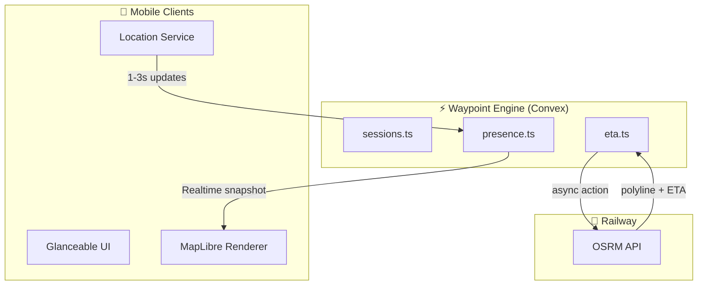

# Gather — Implementation Plan (v3)

> **Gather** is a mobile-first, real-time, session-based shared journey coordination app.  
> **Waypoint** is the backend engine powering it, built on Convex.

---

## Locked Decisions

| Decision | Choice |
|----------|--------|
| Mobile Framework | React Native (Expo) |
| Backend Core | Convex |
| Auxiliary Services | Railway (OSRM routing wrapper) |
| **Map Renderer** | **MapLibre GL + OpenStreetMap tiles** |
| Authentication | Anonymous / device-based (MVP) |
| Architecture | Session-first, backend-authoritative |

> [!IMPORTANT]
> **No external navigation handoffs.** All map interactions stay within Gather.  
> Google Maps SDK is explicitly NOT used due to forced intent behavior.

---

## Architecture Overview



**Key Principle:** No client talks to other clients. All truth flows through Waypoint.

---

## Map Rendering Layer

The map is rendered **entirely in-app** using MapLibre GL with OpenStreetMap tiles.

| What | Technology |
|------|------------|
| Tile Renderer | MapLibre GL Native |
| Tile Source | CartoDB Dark Matter (OSM-based) |
| Participant Markers | Custom MarkerViews |
| Route Polylines | ShapeSource + LineLayer |
| Gestures | Pan, zoom, rotate (all in-app) |

**MapLibre handles:**
- Tile rendering
- Gesture handling
- Marker display
- Polyline overlay

**Waypoint handles:**
- All location data (source of truth)
- Route computation via OSRM
- Session lifecycle

---

## Waypoint Service Breakdown

### sessions.ts
| Function | Type | Purpose |
|----------|------|---------|
| `createSession` | mutation | Generate sessionId, set TTL, return invite code |
| `joinSession` | mutation | Validate session, add participant, init presence |
| `leaveSession` | mutation | Remove participant, cleanup if empty |
| `getSession` | query | Fetch session details |

### presence.ts
| Function | Type | Purpose |
|----------|------|---------|
| `updateLocation` | mutation | Validate, sanity check, upsert presence snapshot |
| `reportDelay` | mutation | Set/clear user-declared delay status |
| `getLiveParticipants` | query | Return active participants + presence + delay |

### eta.ts
| Function | Type | Purpose |
|----------|------|---------|
| `computeRoute` | action | Call Railway OSRM, cache polyline + ETA |
| `getETAs` | query | Return ETA per participant |

---

## Anti-Abuse & Sanity Checks

```typescript
const MAX_SPEED_MPS = 50;       // ~180 km/h
const MIN_UPDATE_INTERVAL_MS = 500;
const STALE_THRESHOLD_MS = 60000; // 60 seconds

// Sanity checks before accepting location update:
// 1. Reject impossible speed jumps (teleporting)
// 2. Clamp GPS noise (accuracy > 100m → reject)
// 3. Throttle update frequency
// 4. Validate participant belongs to session
```

---

## User-Declared Delay Feature

> [!IMPORTANT]
> This is a **coordination signal**, NOT traffic prediction.

### Why This Exists
Waypoint cannot predict traffic. But Gather is about **human coordination**:
- "Are you delayed?" → "By how much?" → "Should we wait?"

### Backend Behavior
```typescript
reportDelay(sessionId, {
  type: "traffic" | "blocked" | "slow" | "other",
  delayMinutes: number
})

// Rules:
// - Self-report only
// - Auto-expires after 15 minutes
// - Included in session snapshot
// - Does NOT modify routes or ETA calculations
```

---

## Mobile App Structure

```
gather/
├── app/                         # Expo Router
│   ├── _layout.tsx              # Providers
│   ├── index.tsx                # Home (create/join)
│   └── session/[id].tsx         # Active session
│
├── components/
│   ├── SessionMap.tsx           # MapLibre map container
│   └── DestinationPicker.tsx    # Destination modal
│
├── hooks/
│   └── useLocation.ts           # GPS tracking hook
│
├── lib/
│   ├── device.ts                # Device ID generation
│   └── geo.ts                   # Haversine, formatting
│
└── convex/                      # Backend functions
```

---

## What Waypoint Does NOT Do

| Out of Scope | Reason |
|--------------|--------|
| Own map tiles | Use OSM via MapLibre |
| **Google Maps SDK** | Forces external app handoffs |
| Predict traffic | Use delay signals instead |
| Store GPS history | Snapshot model only |

---

## Summary

Waypoint is a **real-time session engine** for spatial presence.  
Gather is a coordination app — the map is part of the experience, not a gateway to another app.
