# Gather Mobile App — Implementation Plan (v2)

> **Gather** is a mobile-first, real-time, session-based shared journey coordination app.  
> **Waypoint** is the backend engine powering it, built on Convex.

---

## 1. Problem Statement

A small group shares live location while moving toward a common destination. They see each other's positions, routes, and ETAs in real time — with a glanceable, mobile-optimized experience.

**This is NOT:** A navigation app, ride-hailing service, or map explorer.  
**This IS:** A presence-first, session-first, intent-driven coordination tool.

---

## 2. Locked Decisions

| Decision | Choice |
|----------|--------|
| Mobile Framework | React Native (Expo) |
| Backend Core | Convex |
| Auxiliary Services | Railway (OSRM routing wrapper) |
| Authentication | Anonymous / device-based (MVP) |
| Architecture | Session-first, backend-authoritative |
| Client Role | Smooth interpolation & animation |
| Backend Role | Correctness, validation, fan-out |

---

## 3. Architecture Overview


**Key Principle:** No client talks to other clients. All truth flows through Waypoint.

---

## 4. Convex Schema (Aligned with Blueprint)

```typescript
// convex/schema.ts

import { defineSchema, defineTable } from "convex/server";
import { v } from "convex/values";

export default defineSchema({
  // Core session object
  sessions: defineTable({
    code: v.string(),                    // 6-char invite code
    destination: v.optional(v.object({
      lat: v.number(),
      lng: v.number(),
      name: v.optional(v.string()),
    })),
    status: v.union(
      v.literal("active"),
      v.literal("ended")
    ),
    createdAt: v.number(),
    expiresAt: v.number(),
  })
    .index("by_code", ["code"])
    .index("by_status", ["status"]),

  // Session participants
  participants: defineTable({
    sessionId: v.id("sessions"),
    deviceId: v.string(),                // Anonymous device identifier
    displayName: v.string(),
    color: v.string(),
    joinedAt: v.number(),
    lastSeenAt: v.number(),              // For presence timeout
  })
    .index("by_session", ["sessionId"])
    .index("by_device_session", ["deviceId", "sessionId"]),

  // SNAPSHOT: One row per participant (NEVER accumulate history)
  // INVARIANT: Always PATCH, never INSERT if exists
  presence: defineTable({
    participantId: v.id("participants"),
    sessionId: v.id("sessions"),
    lat: v.number(),
    lng: v.number(),
    heading: v.optional(v.number()),
    speed: v.optional(v.number()),
    accuracy: v.optional(v.number()),
    updatedAt: v.number(),
    // USER-DECLARED DELAY SIGNAL (ephemeral, auto-expires)
    delayStatus: v.optional(v.object({
      type: v.union(
        v.literal("traffic"),
        v.literal("blocked"),
        v.literal("slow"),
        v.literal("other")
      ),
      delayMinutes: v.number(),       // User-estimated delay
      reportedAt: v.number(),         // Auto-expires after 10-15 min
    })),
  })
    .index("by_session", ["sessionId"])
    .index("by_participant", ["participantId"]),

  // Cached routes (optional, for ETA computation)
  routes: defineTable({
    sessionId: v.id("sessions"),
    participantId: v.id("participants"),
    polyline: v.string(),                // Encoded polyline
    distanceMeters: v.number(),
    etaSeconds: v.number(),
    computedAt: v.number(),
  })
    .index("by_session", ["sessionId"])
    .index("by_participant", ["participantId"]),
});
```

> [!IMPORTANT]
> **Location Storage Invariant**  
> The `presence` table holds ONLY the latest location per participant.  
> This is a snapshot, not a stream. Always `patch()`, never `insert()` if a row exists.

---

## 5. Waypoint Service Breakdown

### sessions.ts

| Function | Type | Purpose |
|----------|------|---------|
| `createSession` | mutation | Generate sessionId, set TTL, return invite code |
| `joinSession` | mutation | Validate session, add participant, init presence |
| `leaveSession` | mutation | Remove participant, cleanup if empty |
| `endSession` | mutation | Mark session as ended |
| `getSession` | query | Fetch session details |

### presence.ts

| Function | Type | Purpose |
|----------|------|---------|
| `updateLocation` | mutation | Validate, sanity check, upsert presence snapshot |
| `reportDelay` | mutation | Set/clear user-declared delay status |
| `getLiveParticipants` | query | Return active participants + presence + delay (auto-subscribed) |

**Presence vs Location:**
- Presence = participant is active (based on `lastSeenAt` threshold)
- Location = last known coordinates
- Delay = user-declared slowdown signal (NOT traffic prediction)
- `getLiveParticipants` filters out stale participants (e.g., >60s inactive)
- `getLiveParticipants` auto-expires delay signals older than 15 minutes

### destination.ts

| Function | Type | Purpose |
|----------|------|---------|
| `setWaypoint` | mutation | Update destination, invalidate cached routes |
| `clearWaypoint` | mutation | Remove destination |
| `getWaypoint` | query | Fetch current destination |

### eta.ts

| Function | Type | Purpose |
|----------|------|---------|
| `computeRoute` | action | Call Railway OSRM, cache polyline + ETA |
| `getETAs` | query | Return ETA per participant, recompute if stale |

---

## 6. Anti-Abuse & Sanity Checks

```typescript
// In presence.ts updateLocation mutation

const MAX_SPEED_MPS = 50;       // ~180 km/h
const MIN_UPDATE_INTERVAL_MS = 500;
const STALE_THRESHOLD_MS = 60000; // 60 seconds

// Sanity checks before accepting location update:
// 1. Reject impossible speed jumps (teleporting)
// 2. Clamp GPS noise (accuracy > 100m → reject)
// 3. Throttle update frequency
// 4. Validate participant belongs to session
```

---

## 7. Routing Integration (Railway OSRM)

```mermaid
sequenceDiagram
    participant Client as 📱 Client
    participant Convex as ⚡ Convex
    participant Railway as 🚂 Railway OSRM

    Client->>Convex: setWaypoint(destination)
    Convex->>Convex: Invalidate cached routes
    
    loop For each participant
        Convex->>Railway: GET /route?origin=...&dest=...
        Railway-->>Convex: polyline, distance, ETA
        Convex->>Convex: Cache in routes table
    end
    
    Client->>Convex: Subscribe getETAs()
    Convex-->>Client: ETAs + polylines
```



**Route recomputation triggers:**
- Destination changes
- Participant moves >500m from last route origin
- Route older than 5 minutes

---

## 8. Client Architecture (Session Snapshot Model)

The client treats session state as a **single unified snapshot**:

```typescript
interface SessionSnapshot {
  session: {
    id: string;
    code: string;
    status: "active" | "ended";
  };
  destination: {
    lat: number;
    lng: number;
    name?: string;
  } | null;
  participants: Array<{
    id: string;
    displayName: string;
    color: string;
    location: {
      lat: number;
      lng: number;
      heading?: number;
      speed?: number;
    };
    eta?: {
      seconds: number;
      distanceMeters: number;
      polyline: string;
    };
    // User-declared delay (coordination signal, NOT traffic prediction)
    delay?: {
      type: "traffic" | "blocked" | "slow" | "other";
      minutes: number;
      isExpired: boolean;  // True if >15 min old
    };
    isActive: boolean;  // Based on lastSeenAt threshold
  }>;
}
```

**Client responsibilities:**
1. Subscribe to Convex queries
2. Merge into unified snapshot
3. Interpolate positions smoothly (60fps)
4. Avoid coupling UI to individual tables

---

## 9. Mobile App Structure

```
gather-app/
├── app/                         # Expo Router
│   ├── _layout.tsx              # Providers (Convex, etc.)
│   ├── index.tsx                # Home (create/join)
│   ├── session/[id].tsx         # Active session
│   └── join/[code].tsx          # Deep link join
│
├── components/
│   ├── map/
│   │   ├── SessionMap.tsx       # Map container
│   │   ├── ParticipantMarker.tsx
│   │   ├── RoutePolyline.tsx
│   │   └── DestinationMarker.tsx
│   │
│   └── session/
│       ├── ParticipantList.tsx
│       ├── ETAPanel.tsx
│       └── ShareSheet.tsx
│
├── hooks/
│   ├── useSessionSnapshot.ts    # Unified snapshot hook
│   ├── useLocationTracking.ts   # Background GPS
│   └── useInterpolation.ts      # Smooth movement
│
├── lib/
│   ├── convex.ts                # Client setup
│   ├── device.ts                # Device ID generation
│   └── geo.ts                   # Haversine, etc.
│
└── convex/                      # Backend (as above)
```

---

## 10. Real-Time Data Flow


---

## 11. Proposed File Inventory

### Backend (Convex)

| File | Purpose |
|------|---------|
| `convex/schema.ts` | Data models (sessions, participants, presence, routes) |
| `convex/sessions.ts` | Session lifecycle |
| `convex/presence.ts` | Location snapshots + live query |
| `convex/destination.ts` | Waypoint management |
| `convex/eta.ts` | Route computation via Railway |
| `convex/auth.ts` | Device-based identity |
| `convex/crons.ts` | Session expiry job |

### Railway

| File | Purpose |
|------|---------|
| `routing-service/index.ts` | OSRM wrapper API |

### Mobile App

| Directory | Purpose |
|-----------|---------|
| `app/` | Expo Router screens |
| `components/map/` | Map visualization |
| `components/session/` | Session UI |
| `hooks/` | State + subscriptions |
| `lib/` | Utilities |

---

## 12. Verification Plan

### Automated

- Convex function tests (`npx convex test`)
- React Native unit tests (Jest)
- E2E tests (Detox)

### Manual Checklist

- [ ] Create session → code generated
- [ ] Join via code → participant appears
- [ ] Location updates → real-time sync
- [ ] Stale participant → filtered from map
- [ ] Set destination → routes computed
- [ ] ETA accuracy check
- [ ] App backgrounded → location continues
- [ ] Session expiry → auto-cleanup
- [ ] Report delay → badge appears on marker
- [ ] Delay auto-expires → badge disappears after 15 min

---

## 13. User-Declared Delay Feature

> [!IMPORTANT]
> This is a **coordination signal**, NOT traffic prediction.  
> Waypoint does not infer road conditions — users explicitly declare delays.

### Why This Exists

Waypoint cannot predict traffic because it lacks global road data. But Gather is about **human coordination**, where what matters is:
- "Are you delayed?" → "By how much?" → "Should we wait?"

User-declared delay is honest, intentional, and architecturally clean.

### Backend Behavior

```typescript
// reportDelay mutation
reportDelay(sessionId, {
  type: "traffic" | "blocked" | "slow" | "other",
  delayMinutes: number
})

// Rules:
// - Self-report only (user marks their own delay)
// - Auto-expires after 15 minutes
// - Included in session snapshot
// - Does NOT modify routes or ETA calculations
```

### Client UX

Display delay as a **social signal**, not a map rewrite:

| Element | Treatment |
|---------|-----------|
| Marker | Small ⚠️ warning badge |
| ETA label | Annotate: "~20 min · delayed" |
| Interaction | One-tap "Running Late" button |

No typing-heavy UI. No chat. Maximum 2 taps.

---

## 14. What Waypoint Does NOT Do

| Out of Scope | Reason |
|--------------|--------|
| Own map tiles | Use MapBox/Google |
| **Predict traffic** | Use delay signals instead |
| Store GPS history | Snapshot model only |
| Chat/messaging | Future layer |
| ML smoothing | Client interpolation sufficient |

---

## Summary

Waypoint is a **real-time session engine** for spatial presence.  
Gather is just one client of Waypoint.

Ready for implementation upon approval.
